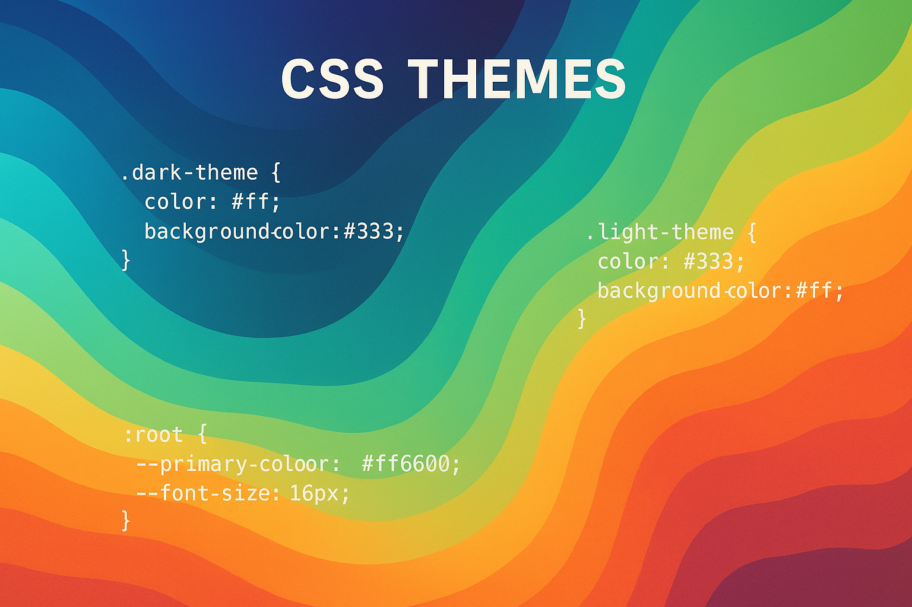

# CSS Theme System

Um sistema dinâmico de gerenciamento de temas CSS, utilizando **CSS Custom Properties** para criar interfaces adaptáveis e personalizáveis. Este repositório serve como um exemplo prático de como implementar um sistema de temas robusto e flexível em projetos web.

## 📖 Documentação

Para uma descrição detalhada do projeto, suas funcionalidades, como usar e contribuir, por favor, consulte a documentação completa:

- [**Português (Brasil)**](docs/README.pt-br.md)
- [**English**](docs/README.en.md)

## 🖼️ Imagem Hero

## 🚀 Demonstração

Uma demonstração interativa do sistema de temas pode ser encontrada [aqui](#).

## 👨‍💻 Autor

**Gabriel Demetrios Lafis**

- GitHub: [@galafis](https://github.com/galafis)
- Email: gabrieldemetrios@gmail.com

---

⭐ Se este projeto foi útil, considere deixar uma estrela!

