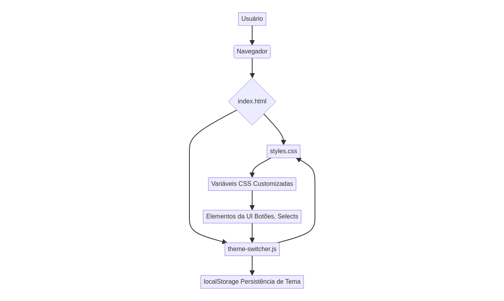

# CSS Theme System


A dynamic CSS theme management system using CSS Custom Properties to create adaptable and customizable interfaces.

## 🎨 Demo

This project implements a CSS variable-based theme system that allows dynamic changes to colors and styles throughout the application. An interactive demo can be found [here](#).

## ✨ Features

- **CSS Custom Properties**: Uses `--primary-color` and `--secondary-color` for centralized control.
- **Dynamic Gradients**: Responsive linear gradient background that adapts to themes.
- **Smooth Transitions**: Hover effects with CSS transformations for a fluid user experience.
- **Responsive Design**: Adaptive layout for different devices and screen sizes.
- **Modern Typography**: Segoe UI font for improved readability and aesthetics.
- **Theme Persistence**: Theme and mode (light/dark) preferences are saved in the browser's `localStorage`.

## 🛠️ Technologies

- **HTML5**: Semantic and accessible structure for page content.
- **CSS3**: Advanced styling, including custom variables, gradients, and transitions.
- **JavaScript (ES6+)**: Logic for theme switching, state management, and persistence.

## 📁 Project Structure

```
CSS-Theme-System/
├── src/
│   ├── index.html          # Main page with UI demonstration
│   ├── styles.css          # Theme system and global styles
│   └── theme-switcher.js   # JavaScript logic for theme management
├── tests/
│   └── theme-switcher.test.js # Unit tests for theme-switcher.js
├── docs/
│   ├── architecture_diagram.md # System architecture diagram (Mermaid)
│   ├── architecture_diagram.png # Architecture diagram image
│   ├── hero_image.png      # Hero image for the repository
│   ├── README.pt-br.md     # This documentation in Portuguese (Brazil)
│   └── README.en.md        # Documentation in English
├── .gitignore              # Files ignored by Git
├── LICENSE                 # MIT License
└── README.md               # Main documentation (links to bilingual versions)
```

## 🚀 How to Use

### Installation

1. Clone the repository:
```bash
git clone https://github.com/galafis/CSS-Theme-System.git
cd CSS-Theme-System
```

2. Open the `src/index.html` file in your browser or use a local server for viewing:
```bash
# Using Python (simple HTTP server)
python -m http.server 8000 --directory src/

# Using Node.js (with 'serve' globally installed)
npx serve src/
```

### Theme Customization

To create new themes or modify existing ones, adjust the CSS variables in the `src/styles.css` file:

```css
:root {
    --primary-color: #667eea;    /* Primary color */
    --secondary-color: #764ba2;  /* Secondary color */
}

[data-theme="green"] {
    --primary-color: #11998e;
    --secondary-color: #38ef7d;
}

[data-theme="orange"] {
    --primary-color: #ff9a9e;
    --secondary-color: #fecfef;
}
```

## 📊 Architecture Diagram

The diagram below illustrates the architecture of the CSS theme system:



## 🎯 Implemented Features

- ✅ Centralized CSS variable system for easy customization.
- ✅ Dynamic background gradient that adapts to the selected theme.
- ✅ Button with hover effects and smooth transitions.
- ✅ Responsive layout to ensure compatibility with various devices.
- ✅ Optimized typography for better readability.
- ✅ Light/dark mode switching with persistence.
- ✅ Unit tests for theme management logic.

## 🔧 Possible Extensions

- [ ] Add more predefined themes.
- [ ] Allow users to create and save custom themes via the interface.
- [ ] Integrate with a CSS framework (e.g., Bootstrap, Tailwind CSS) for thematic components.
- [ ] Improve theme transition animations.
- [ ] Add support for high-contrast themes for accessibility.

## 🤝 Contributing

Contributions are welcome! To contribute to this project, follow these steps:

1. Fork the repository.
2. Create a new branch for your feature (`git checkout -b feature/your-feature`).
3. Make your changes and add tests, if necessary.
4. Ensure all tests pass.
5. Commit your changes (`git commit -m 'Adds new feature'`).
6. Push to the branch (`git push origin feature/your-feature`).
7. Open a Pull Request detailing your changes.

## 📄 License

This project is licensed under the MIT License - see the [LICENSE](LICENSE) file for details.

## 👨‍💻 Author

**Gabriel Demetrios Lafis**

- GitHub: [@galafis](https://github.com/galafis)
- Email: gabrieldemetrios@gmail.com

---

⭐ If this project was helpful, consider leaving a star!

