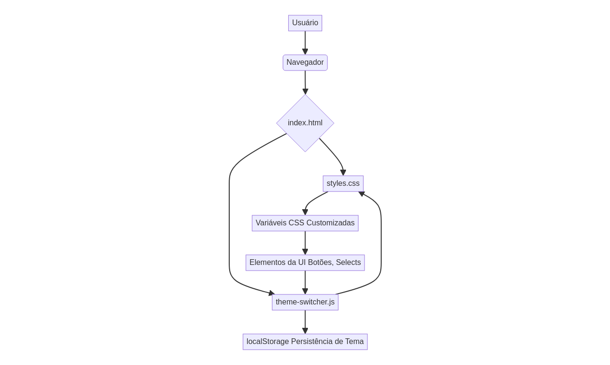

# Sistema de Temas CSS


Sistema de gerenciamento dinâmico de temas CSS utilizando variáveis CSS customizadas (CSS Custom Properties) para criar interfaces adaptáveis e personalizáveis.

## 🎨 Demonstração

O projeto implementa um sistema de temas baseado em variáveis CSS que permite mudanças dinâmicas de cores e estilos em toda a aplicação. Uma demonstração interativa pode ser encontrada [aqui](#).

## ✨ Características

- **Variáveis CSS Customizadas**: Uso de `--primary-color` e `--secondary-color` para controle centralizado.
- **Gradientes Dinâmicos**: Background com gradiente linear responsivo que se adapta aos temas.
- **Transições Suaves**: Efeitos de hover com transformações CSS para uma experiência de usuário fluida.
- **Design Responsivo**: Layout adaptável para diferentes dispositivos e tamanhos de tela.
- **Tipografia Moderna**: Fonte Segoe UI para melhor legibilidade e estética.
- **Persistência de Tema**: As preferências de tema e modo (claro/escuro) são salvas no `localStorage` do navegador.

## 🛠️ Tecnologias

- **HTML5**: Estrutura semântica e acessível para o conteúdo da página.
- **CSS3**: Estilização avançada, incluindo variáveis customizadas, gradientes e transições.
- **JavaScript (ES6+)**: Lógica para alternância de temas, gerenciamento de estado e persistência.

## 📁 Estrutura do Projeto

```
CSS-Theme-System/
├── src/
│   ├── index.html          # Página principal com demonstração da UI
│   ├── styles.css          # Sistema de temas e estilos globais
│   └── theme-switcher.js   # Lógica JavaScript para gerenciamento de temas
├── tests/
│   └── theme-switcher.test.js # Testes unitários para theme-switcher.js
├── docs/
│   ├── architecture_diagram.md # Diagrama de arquitetura do sistema (Mermaid)
│   ├── architecture_diagram.png # Imagem do diagrama de arquitetura
│   ├── hero_image.png      # Imagem hero para o repositório
│   └── README.pt-br.md     # Esta documentação em Português (Brasil)
│   └── README.en.md        # Documentação em Inglês
├── .gitignore              # Arquivos ignorados pelo Git
├── LICENSE                 # Licença MIT
└── README.md               # Documentação principal (links para versões bilíngues)
```

## 🚀 Como Usar

### Instalação

1. Clone o repositório:
```bash
git clone https://github.com/galafis/CSS-Theme-System.git
cd CSS-Theme-System
```

2. Abra o arquivo `src/index.html` no seu navegador ou use um servidor local para visualização:
```bash
# Usando Python (servidor HTTP simples)
python -m http.server 8000 --directory src/

# Usando Node.js (com 'serve' instalado globalmente)
npx serve src/
```

### Personalização de Temas

Para criar novos temas ou modificar os existentes, ajuste as variáveis CSS no arquivo `src/styles.css`:

```css
:root {
    --primary-color: #667eea;    /* Cor primária */
    --secondary-color: #764ba2;  /* Cor secundária */
}

[data-theme="green"] {
    --primary-color: #11998e;
    --secondary-color: #38ef7d;
}

[data-theme="orange"] {
    --primary-color: #ff9a9e;
    --secondary-color: #fecfef;
}
```

## 📊 Diagrama de Arquitetura

O diagrama abaixo ilustra a arquitetura do sistema de temas CSS:



## 🎯 Funcionalidades Implementadas

- ✅ Sistema de variáveis CSS centralizadas para fácil personalização.
- ✅ Gradiente dinâmico no background que se adapta ao tema selecionado.
- ✅ Botão com efeitos de hover e transições suaves.
- ✅ Layout responsivo para garantir compatibilidade com diversos dispositivos.
- ✅ Tipografia otimizada para melhor legibilidade.
- ✅ Alternância entre modo claro e escuro com persistência.
- ✅ Testes unitários para a lógica de gerenciamento de temas.

## 🔧 Extensões Possíveis

- [ ] Adicionar mais temas predefinidos.
- [ ] Permitir que o usuário crie e salve temas personalizados via interface.
- [ ] Integrar com um framework CSS (ex: Bootstrap, Tailwind CSS) para componentes temáticos.
- [ ] Melhorar as animações de transição entre temas.
- [ ] Adicionar suporte a temas de alto contraste para acessibilidade.

## 🤝 Contribuindo

Contribuições são bem-vindas! Para contribuir com este projeto, siga os passos:

1. Faça um fork do repositório.
2. Crie uma nova branch para sua feature (`git checkout -b feature/sua-feature`).
3. Faça suas alterações e adicione testes, se necessário.
4. Certifique-se de que todos os testes passem.
5. Commit suas mudanças (`git commit -m 'Adiciona nova feature'`).
6. Envie para a branch (`git push origin feature/sua-feature`).
7. Abra um Pull Request detalhando suas alterações.

## 📄 Licença

Este projeto está licenciado sob a Licença MIT - veja o arquivo [LICENSE](LICENSE) para detalhes.

## 👨‍💻 Autor

**Gabriel Demetrios Lafis**

- GitHub: [@galafis](https://github.com/galafis)
- Email: gabrieldemetrios@gmail.com

---

⭐ Se este projeto foi útil, considere deixar uma estrela!

