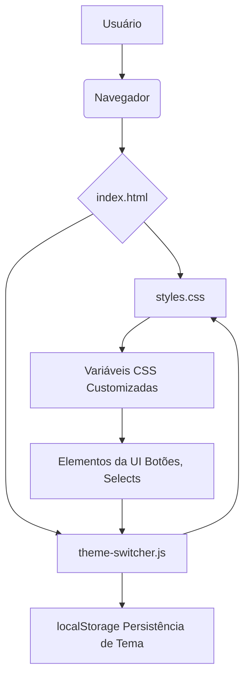

```mermaid
graph TD
    A[Usuário] --> B(Navegador)
    B --> C{index.html}
    C --> D[styles.css]
    C --> E[theme-switcher.js]
    E --> F[localStorage Persistência de Tema]
    E --> D
    D --> G[Variáveis CSS Customizadas]
    G --> H[Elementos da UI Botões, Selects]
    H --> E
```

